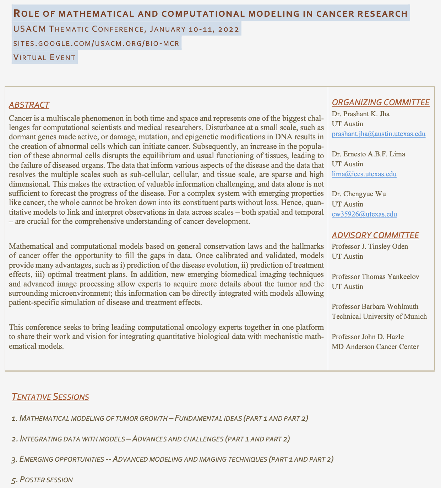

With colleagues, Ernesto Lima and Chengyue Wu, at Oden Institute, we are organizing a virtual thematic conference on computational oncology. The event is supported by Biological Systems TTA in **USACM**. We have a greate lineup of speakers and very excited to bring experts in one platform to discuss the modeling and data related issues in modeling cancer. 

We are seeking abstract for speakers. Abstract is due **November 15**! The link for the registration and other details about the conference is [here](https://sites.google.com/usacm.org/bio-mcr/home). The screenshot of flyer is attached below. PDF file of flyer can be downloaded from this [link](flyer_USACM_onco.pdf).

