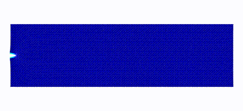
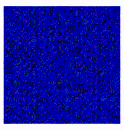
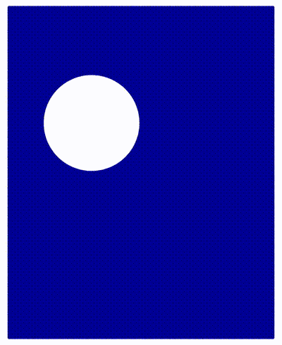
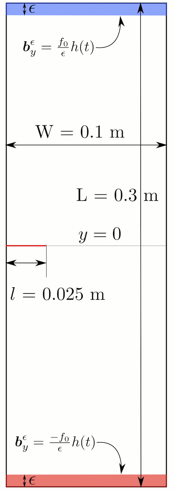
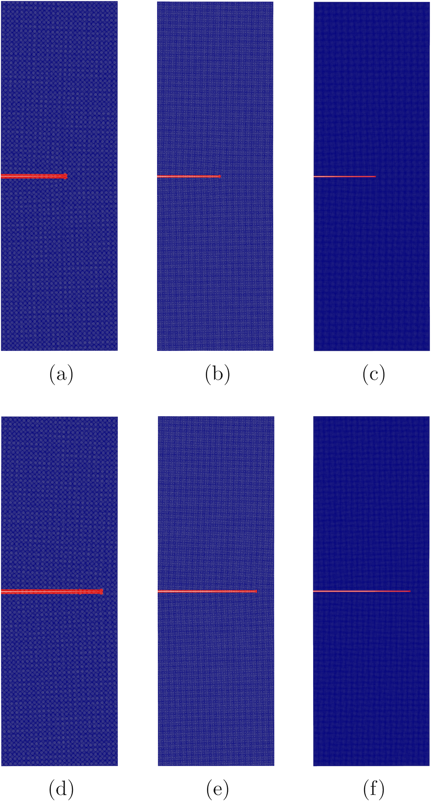

+++
# Project title.
title = "Analysis and application of peridynamics"

# Date this page was created.
date = 2020-07-18T00:00:00

# Project summary to display on homepage.
summary = "Analysis and application of peridynamics"

# Tags: can be used for filtering projects.
# Example: `tags = ["machine-learning", "deep-learning"]`
tags = ["peridynamics", "nonlocal", "fracture mechanics", "computational mechanics"]

# Optional external URL for project (replaces project detail page).
external_link = ""

# Slides (optional).
#   Associate this project with Markdown slides.
#   Simply enter your slide deck's filename without extension.
#   E.g. `slides = "example-slides"` references 
#   `content/slides/example-slides.md`.
#   Otherwise, set `slides = ""`.
#slides = "example-slides"

# Links (optional).
url_pdf = ""
url_slides = ""
url_video = ""
url_code = ""

# Featured image
# To use, add an image named `featured.jpg/png` to your project's folder. 
[image]
  # Caption (optional)
  caption = "Crack speed and plot of damage for mode-I problem (Int J Fra (2020) Jha and Lipton)"
  
  # Focal point (optional)
  # Options: Smart, Center, TopLeft, Top, TopRight, Left, Right, BottomLeft, Bottom, BottomRight
  focal_point = "Smart"
+++

# Activities

## 1. Kinetic relations and local energy balance for LEFM from a nonlocal peridynamic model

In this work, we carefully looked at the peridynamic energy associated with the process zone. We recovered the kinetic relation for crack tip velocity for the mode-I crack problem. It is based on more theoretical work; see [Lipton and Jha 2021]( ), [Jha and Lipton 2020]( ). This is joint work with Dr. R. Lipton.

Some interesting simulations are shown next.

|  | 
| :--: | 
| *Simulation of Mode-I propagation. We apply vertically outward displacement boundary conditions on the small layer in the top and bottom. Material has initial pre-crack. Simulation from [article](https://link.springer.com/article/10.1007/s10704-020-00480-0)* |

|  |  |
| :--: |  :--: | 
| *Inclined crack propagation. We apply diagonally outward force in small regions near the right-top and left-bottom corner. Simulation from [article](https://link.springer.com/article/10.1007/s42102-019-00010-0). Here red indicates a node with one or more broken bonds in its neighborhood.* | *Crack propagation in the presence of the void. We see that void deflects the crack moving straight.* |

## 2. A priori error analysis and well-posedness of nonlinear peridynamic models

At Louisiana State University, I had spent a good amount of time working on *a priori* error estimates for finite-difference and finite-element discretization of and well-posedness of nonlinear peridynamic models. This was under the guidance of my adviser Dr. R. Lipton. On this topic, we have published several journal articles and few book chapters, see [publication page]( ). 

We know that peridynamics regularizes the discontinuity; the sharp edge of discontinuity is replaced with the softening zone containing material points with large strains (classical strain). Away from the softening zone, the strains are smaller. Typically the size of the softening zone is proportional to the nonlocal length scale. As the nonlocal length scale goes to zero, the softening zone localizes to a sharp crack. To demonstrate this, we consider a setup shown in Figure 1. In Figure 2, we plot the damage for three different nonlocal length scales at two times. We see that for a smaller nonlocal length scale, the softening zone indicated by the red region is smaller than that of a bigger nonlocal length scale. In Figure 3, we put the plots of three horizons on top of each other, and we see the localization of the softening zone.

|  |  |
| :--: | :--: | 
| *Figure 1: Setup for localization of softening zone. More details [preprint, section 6](https://arxiv.org/abs/1908.07589)* | *Figure 2: Damage in material with three horizons at two times.* |

|  | 
|:--:| 
| *Figure 3: Softening zone of three horizons when placed on top of each other. Light yellow, light orange, and red correspond to smaller, intermediate, and larger horizons. As the horizon is getting smaller softening zone is shrinking to a very thin region, and ultimately in the limit, it will tend to sharp crack.* |

## 3. Model development

In this [article]( ), we proposed a bond-based peridynamic model with memory effect. If the material is subjected to cyclic loading, with each cycle deforming the material beyond some critical strain, it will continue to lose stiffness in every loading cycle. This effect is simulated using the temporal nonlocal force (material strength at a current time depends on the history) in the proposed model.

