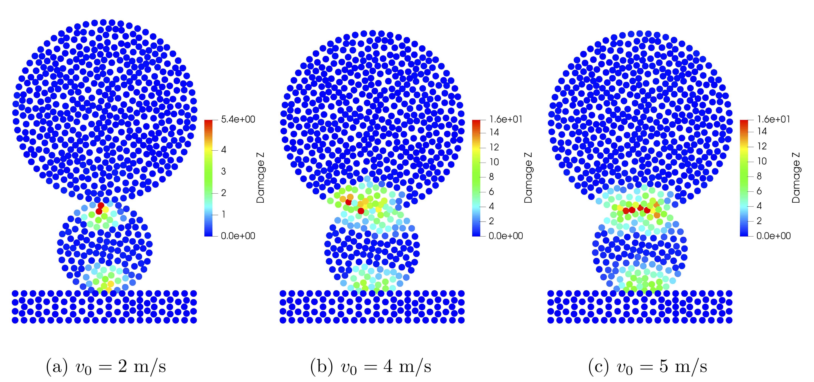
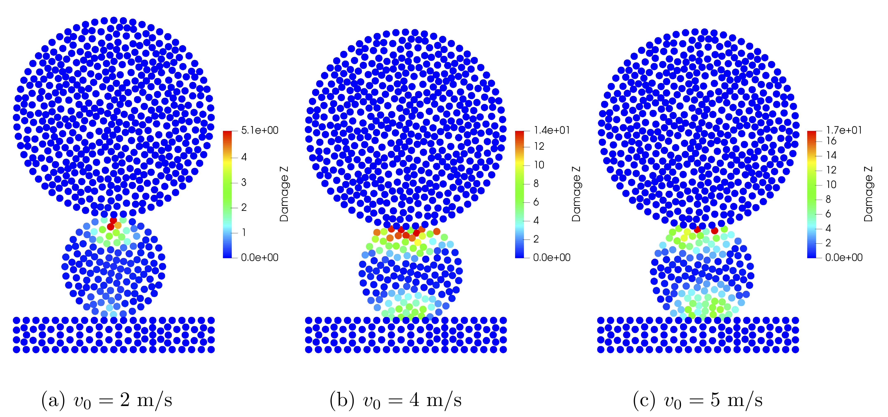
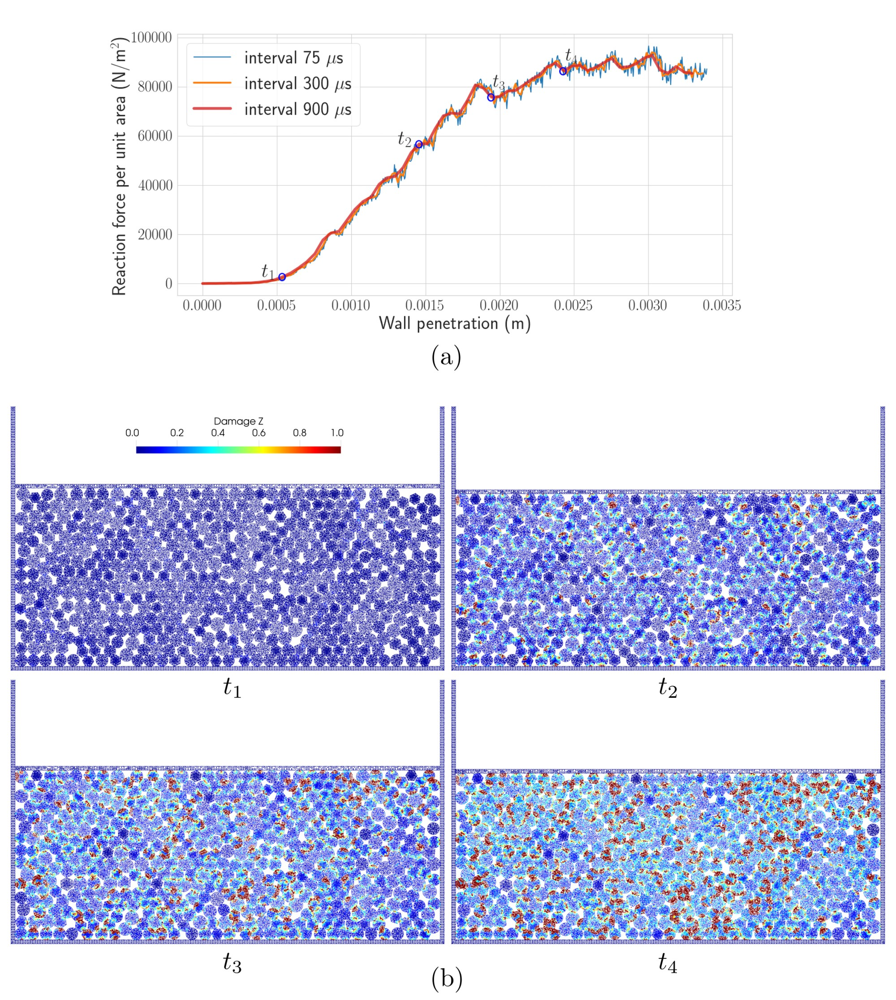
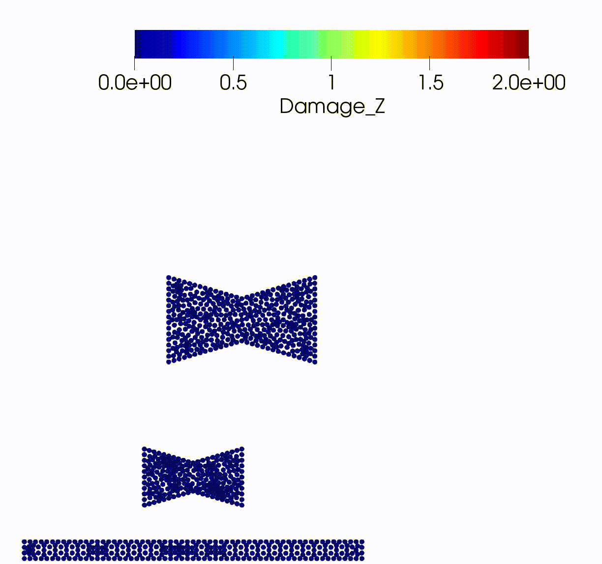

# Activities

## 1. Development of a high-fidelity model for granular media

Taking the earlier research on peridynamics for granular media forward, we have developed the Peridynamics-DEM high-fidelity model that can handle arbitrarily shaped particles and particle breakage. Traditional models based on DEM (Discrete Element Method) can not handle the particles with arbitrary shapes and deformation of individual particles. Extension of DEM based method to overcome these challenges is possible. However, it is not trivial. PeriDEM model proposed in [Jha et al 2021](https://doi.org/10.1016/j.jmps.2021.104376) uses peridynamics for deformation of individual particles. In the model, the contact forces between two particles act at the level of discretization. Because contact forces are applied to discretized nodes (within a small distance) of two particles, particles can see the local boundary; thus, the model can accurately simulate the locking effects.

|  | 
| :---: | 
| *Figure 1: Two-particle test. The top particle is given initial velocity. The plot shows the damage upon contact for different initial velocities—both particles made of the same materials. Damage above 1 indicates the onset of failure. From [Jha et al 2021](https://doi.org/10.1016/j.jmps.2021.104376)* |

|  | 
| :---: | 
| *Figure 2: Same as Figure 1, but now the particle on top is stronger than the bottom particle. We see that only the bottom particle has damage above 1.* |

|  | 
| :---: | 
| *Figure 3: Compressive test using 502 circular and hexagon-shaped particles of varying sizes. The container's top wall is moving downwards. **Top**: Plot of reaction force on the container's top wall as a function of penetration downwards. **Bottom**: Damage on individual particles at different times. Damage on discretized nodes of particles is shown. Red indicates a node has damage one or above. From [Jha et al 2021](https://doi.org/10.1016/j.jmps.2021.104376)* |

|  |  |  |  |
| :---: |:---: |:---: |:---: |
| *Two particles with same properties. $v_0 = 4$ m/s* | *Two particles with same properties. $v_0 = 5$ m/s* | *Top particle stronger than bottom. $v_0 = 4$ m/s* | *Top particle stronger than bottom. $v_0 = 5$ m/s* |

|  | 
| :---: | 
| *Fracture simulation with concave particles.* |

|  | 
| :----: | 
| *PeriDEM simulation collection* |
