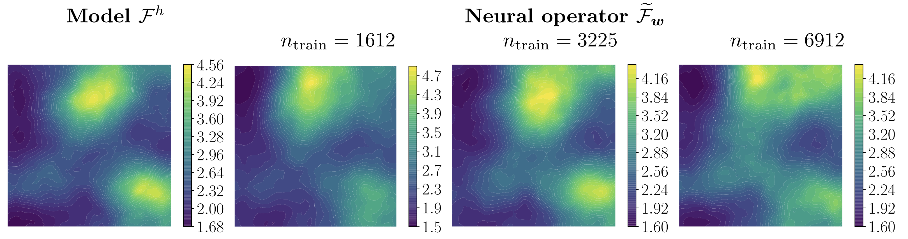
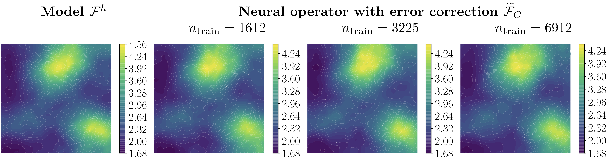
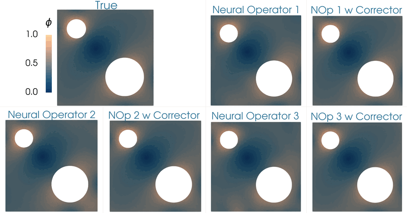

+++
# Project title.
title = "Neural Networks to Accelerate Scientific Computing"

# Date this page was created.
date = 2023-06-22T00:00:00

# Project summary to display on homepage.
summary = "Development and application of neural networks to accelerate scientific computing in areas of mechanistic simulation, parameter estimation, model selection, and optimization of materials and structures."

# Tags: can be used for filtering projects.
# Example: `tags = ["machine-learning", "deep-learning"]`
tags = ["neural networks", "neural operators", "computational mechanics", "partial differential equations", "optimization"]

# Optional external URL for project (replaces project detail page).
external_link = ""

# Slides (optional).
#   Associate this project with Markdown slides.
#   Simply enter your slide deck's filename without extension.
#   E.g. `slides = "example-slides"` references 
#   `content/slides/example-slides.md`.
#   Otherwise, set `slides = ""`.
#slides = "example-slides"

# Links (optional).
url_pdf = ""
url_slides = ""
url_video = ""
url_code = ""

# Featured image
# To use, add an image named `featured.jpg/png` to your project's folder. 
[image]
  # Caption (optional)
  caption = "Topology Optimization of Diffusivity Field"
  
  # Focal point (optional)
  # Options: Smart, Center, TopLeft, Top, TopRight, Left, Right, BottomLeft, Bottom, BottomRight
  focal_point = "Smart"
+++

# Activities

## 1. Goal-Oriented A-Posteriori Estimation of Model Error as an Aid to Parameter Estimation (with Dr. Oden)

We consider the problem of estimating modeling error in boundary – and initial–value problems characterized by partial differential equations (PDEs), with the understanding that the purpose of the prediction, the ultimate goal of the simulation, is to compute specific quantities of interest: the “QoIs”. Mathematically the QoIs are functionals of solutions to the so-called primal or forward problem. We review the theory of goal-oriented a-posteriori estimation of modeling error “Oden and Prudhomme, JCP 182.2 (2002): 496-515”. Here we add to this theory a new ingredient: we explore the question of can such a-posterior estimates of error between a high-fidelity model of a physical system in which parameters are not known with precision, and a surrogate, low-fidelity models with known parameters, be used to infer properties and parameters of the high-fidelity system? We developed a Bayesian framework for studying such issues based on goal-oriented QoI-error estimates, and we give examples in which this approach is very successful. 

This work is published in JCP and can be found in this link: [Jha and Oden (2022)]( ).

## 2. Residual-based error correction for neural operator accelerated infinite-dimensional Bayesian inverse problems (with Lianghao, Thomas, Dr. Oden, and Omar)

We explore using neural operators, or neural network representations of nonlinear maps between function spaces, to accelerate infinite-dimensional Bayesian inverse problems (BIPs) with models governed by nonlinear parametric partial differential equations (PDEs). The computational cost of BIPs can be drastically reduced if the large number of PDE solves required for posterior characterization are replaced with evaluations of trained neural operators. However, reducing error in the resulting BIP solutions via reducing the approximation error of the neural operators in training can be challenging and unreliable. To reliably deploy neural operators in BIPs, we consider a strategy for enhancing the performance of neural operators: correcting the prediction of a trained neural operator by solving a linear variational problem based on the PDE residual. We show that a trained neural operator with error correction can achieve a quadratic reduction of its approximation error, all while retaining substantial computational speedups of posterior sampling when models are governed by highly nonlinear PDEs. The strategy is applied to two numerical examples of BIPs based on a nonlinear reaction–diffusion problem and deformation of hyperelastic materials. 

This work is published in JCP and can be found in this link: [Cao et al. (2023)]( ).

|  | 
| :----: | 
| *Mean of posterior samples of Young's modulus field in a neo-Hookean hyperelastic material model. Left: Results with "true" forward model. Right: Results with neural operators as surrogates of the forward model.* |

|  | 
| :----: | 
| *Mean of posterior samples of Young's modulus field in a neo-Hookean hyperelastic material model. Left: Results with "true" forward model. Right: Results with neural operators with corrector as surrogates of the forward model. See Section 5.4 in [Cao et al. (2023)]( ).* |

## 3. Corrector operator to enhance accuracy and reliability of neural operator surrogates of nonlinear variational boundary-value problems (with Dr. Oden)

This work focuses on developing methods for approximating the solution operators of a class of parametric partial differential equations via neural operators. Neural operators have several challenges, including the issue of generating appropriate training data, cost-accuracy trade-offs, and nontrivial hyperparameter tuning. The unpredictability of the accuracy of neural operators impacts their applications in downstream problems of inference, optimization, and control. A framework is proposed based on the linear variational problem that gives the correction to the prediction furnished by neural operators. The operator associated with the corrector problem is referred to as the corrector operator. Numerical results involving a nonlinear diffusion model in two dimensions with PCANet-type neural operators show almost two orders of increase in the accuracy of approximations when neural operators are corrected using the proposed scheme. Further, topology optimization involving a nonlinear diffusion model is considered to highlight the limitations of neural operators and the efficacy of the correction scheme. Optimizers with neural operator surrogates are seen to make significant errors (as high as 80 percent). However, the errors are much lower (below 7 percent) when neural operators are corrected following the proposed method. 

Preprint of the work can be found in this link: [Jha and Oden (2023)]( ). This work is a culmination of our efforts in using goal-oriented a-posteriori error estimates in Bayesian inference in [Jha and Oden (2022)]( ) and [Cao et al. (2023)]( ).

|  | 
| :----: | 
| *Topology optimization of the diffusivity field in a nonlinear diffusion model. Neural operator and neural operator with corrector employed as a surrogate of the forward model.* |

|  | 
| :----: | 
| *Comparing the optimizers of the topology optimization problem for different cases (1) true forward model, (2) neural operator surrogate of the forward model, and (3) neural operator with corrector. See Section 4.3 in [Jha and Oden (2023)]( ).* | 

