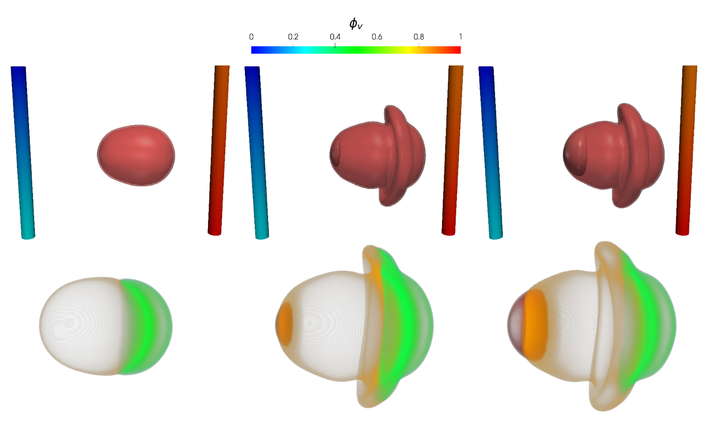
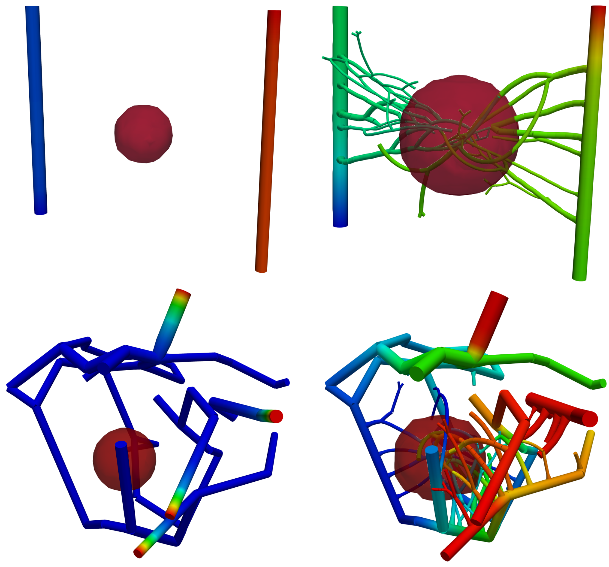
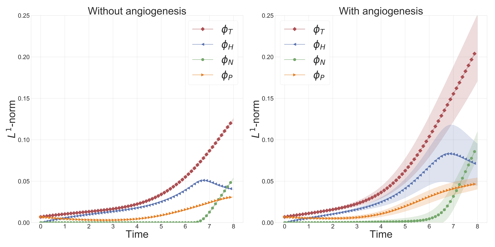

+++
# Project title.
title = "Modeling tumor growth, angiogenesis, drug-therapy, metastasis"

# Date this page was created.
date = 2020-07-18T00:00:00

# Project summary to display on homepage.
summary = "Development and analysis of models of tumor growth, angiogenesis, drug therapy, and metastasis"

# Tags: can be used for filtering projects.
# Example: `tags = ["machine-learning", "deep-learning"]`
tags = ["tumor model", "angiogenesis", "continuum modeling", "computational oncology", "multiphysics modeling"]

# Optional external URL for project (replaces project detail page).
external_link = ""

# Slides (optional).
#   Associate this project with Markdown slides.
#   Simply enter your slide deck's filename without extension.
#   E.g. `slides = "example-slides"` references 
#   `content/slides/example-slides.md`.
#   Otherwise, set `slides = ""`.
#slides = "example-slides"

# Links (optional).
url_pdf = ""
url_slides = ""
url_video = ""
url_code = ""

# Featured image
# To use, add an image named `featured.jpg/png` to your project's folder. 
[image]
  # Caption (optional)
  caption = "Angiogenesis simulation"
  
  # Focal point (optional)
  # Options: Smart, Center, TopLeft, Top, TopRight, Left, Right, BottomLeft, Bottom, BottomRight
  focal_point = "Smart"
+++

# Activities

## 1. Analysis of a new multispecies tumor growth model coupling 3D phase-fields with a 1D vascular network

This is joint work with Dr. J. T. Oden at UT Austin and colleagues at the Technical University of Munich. In this work, we study the 3D-1D model of tumor growth that couples the flow and transport of nutrients in the vessel network with nutrient and tumor evolution in the tissue domain. In particular, we looked at the well-posedness of the resulting highly coupled multi-dimension nonlinear model. See the [article]( ).

Figure 1 below shows progression of tumor towards nutrient rich artery on the right. In top row, the contour $\phi_T = 0.8$ plot of total tumor (sum of prolific, hypoxic, and necrotic) species volume fraction is shown. In bottom row, tumor sub-species, necrotic $\phi_N = 0.4$ (black), hypoxic $\phi_H = 0.45$ (orange), and prolific $\phi_P = 0.5$ (green), are shown. Figure is taken from [article]( ).

|  | 
|:--:| 
| *Figure 1: Tumor growth towards nutrient rich artery* |

## 2. Modeling and simulation of vascular tumors embedded in dynamically evolving capillary networks

This work takes the work in the paper above one step further. In this work, we add the angiogenesis effect to the model. Angiogenesis is a phenomenon through which nutrient-starved tumor cells release unique molecules collectively called TAF (Tumor Angiogenesis Factor), which co-opt the blood vessels in the vicinity to grow towards the tumor colony and supply nutrients. We recently submitted the work for review, see [article]( ).

Figure 2 demonstrates the angiogenesis effect and simultaneous tumor growth. Figure 3 shows the quantity of interests such as total tumor $\phi_T$, prolific $\phi_P$, hypoxic $\phi_H$, and necrotic $\phi_N$ masses with or without angiogenesis. Since angiogenesis is stochastic, we run the simulation multiple times to capture the variation in QoIs. Figures 2 and 3 and simulation videos in this section are from [article]( ).

|  | 
|:--:| 
| *Figure 2: Network growth for two-vessels and complex network settings* |

|  | 
|:--:| 
| *Figure 3: Effect of angiogenesis on tumor associated quantity of interests* |

|  |  |
| :---: |:---: |
| *Angiogenesis simulation, two-vessels setup (sample 1)* | *Angiogenesis simulation, two-vessels setup (sample 2)* |

|  |  |
| :---: |:---: |
| *Angiogenesis simulation, complex network setup (sample 1)* | *Angiogenesis simulation, complex network setup (sample 2)* |

## 3. Application and extension of the 3D-1D model of tumor growth

Next, we are interested in developing a tumor growth model to predict treatment responses and metastasis. For both of these problems, it is necessary to model the coupled flow in tissue and vasculature. We are extending the model to include the flow of drugs in vessels and tissue and its effect on tumor growth. 

While our work so far has been concerned with algorithmic development and abstract simulations that highlight the key capabilities of the model, we are also interested in the model's calibration using MRI data. Towards this, we are working with experts at the [Center for Computational Oncology]( https://cco.oden.utexas.edu/) for the application of the multi-dimensional model to breast cancer. The vasculature, flow parameters, initial tumor region in our model will be based on MRI data. 

It is known that the vessels formed as a result of angiogenesis are leaky and weak; the mechanical forces in the tissue microenvironment plays are role in the modification and destruction of these vessels. The mechanical effects are also observed in the growth of the tumor. We are also interested in adding a mechanical component to the model and coupling the mechanical forces with vessels' displacement and tumor growth.
