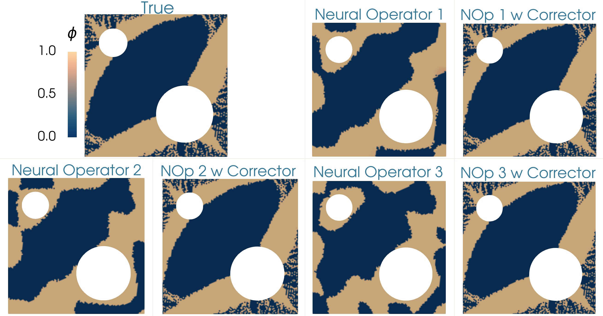

|  | 
| :----: | 
| *Topology optimization of the diffusivity field in a nonlinear diffusion model. Neural operator and neural operator with corrector employed as a surrogate of the forward model.* |

|  | 
| :----: | 
| *Comparing the optimizers of the topology optimization problem for different cases (1) true forward model, (2) neural operator surrogate of the forward model, and (3) neural operator with corrector.* |
